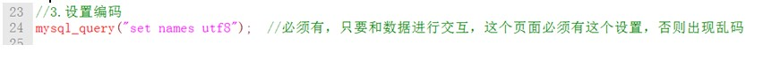

**流程**

**1.连接数据库：mysql\_connect\(服务器地址，用户名，密码）；**

**2.选择数据库：mysql\_select\_db并设置通信编码（mysql\_query\("set names utf8"\)）;**

**3.准备的SQL语句（￥sql="select\*from 表名"）;**

**4.发送SQL语句到服务器\(mysql\_query\($sql\)\);**

**5.服务器接收SQL语句（进行解析-是有结果集--数据-假，没有结果集-真或假）**

**6.客户端接收结果（进行判断）**

**7.继续有结果集的结果进行解析（把资源变化成能看懂的数据）**

**8.关闭数据库连接；**

**               //html编码 **

**&lt;meta charset="utf-8"&gt;**

** //php编码 header\("Content-type:text/html;charset=utf-8"\);**

** //文本工具设置编码**

** //php操作数据库编码 mysql\_query\("set names utf8"\);**

** //数据库设置编码 添加库：create database 数据库民称 charset=utf8;**

**  
**

**1.连接数据库**

**  
**

2.选择数据库

  

**3.设置通信编码**

**    用mysql\_query这个函数把设置字符集语句**

  

**4.准备SQL语句**

**    通过一个变量来存储字符串语句**

**  
**

**    如：$sql="create "**

  

**5.发送SQL语句到服务器**

  

  返回值：返回值分俩种结果

  

 insert 等没有结果集，返回true，

select成功返回资源；

6。解析结果集资源

7.二维数组

    二维数组：每个值是数组

  

8.关闭数据库链接

