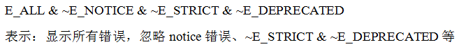
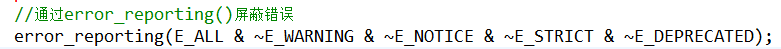
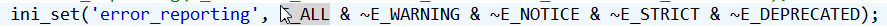

1.错误类型总结

    notice：级别的错误：

    warning：警告错误

    fatal error：致命错误

    syntax error：语法错误

    deprecated:过时的

  

  

2.屏蔽错误

方法1：直接修改php.ini 中的 error\_reporting

错误等级：

    E\_ALL:显示所有级别的错误

    E\_NOTICE:显示notice级别的错误

    E\_STRICT:严格的

&:表示并且的意思

~：忽略

  

 方法2：通过函数error\_reporting设置

 方法3：通过ini\_set（）设置当前脚本的错误级别

 方法4：php.ini:设置display_error:off

方法5：使用@屏蔽

异常处理方法：

    针对可能出现的意外，先尝试执行（try），如果出现意外，抛出一个异常，然后在catch里面接收异常，提出解决方案

错误级别：

| 数字 | 常量 | 说明 |
| :--- | :--- | :--- |
| 1 | E\_ERROR | 致命错误，脚本执行中断，就是脚本中有不可识别的东西出现  举例： Error：Invalid parameters. Invalid parameter name |
| 2 | E\_WARNING | 部分代码出错，但不影响整体运行  举例： Warning: require\_once\(E:/include/config\_base.php\) |
| 4 | E\_PARSE  | 字符、变量或结束的地方写规范有误 举例：  Parse error: syntax error, unexpected $end in |
| 8  |  E\_NOTICE | 一般通知，如变量未定义等 举例：  Notice: Undefined variable: p in E:\web\index.php on line 17 |
| 16  | E\_CORE\_ERROR | PHP进程在启动时，发生了致命性错误  举例：  暂无 |
| 32  | E\_CORE\_WARNING | 在PHP启动时警告\(非致命性错误\) 举例：  暂无 |
| 64 | E\_COMPILE\_ERROR | 编译时致命性错误 举例：  暂无 |
| 128 | E\_COMPILE\_WARNING | 编译时警告级错误 举例：  暂无 |
| 256 | E\_USER\_ERROR  | 用户自定义的错误消息 举例：  暂无 |
| 512 | E\_USER\_WARNING | 用户自定义的警告消息 举例：  暂无 |
| 1024 | E\_USER\_NOTICE  | 用户自定义的提醒消息 举例：  暂无 |
| 2047 | E\_ALL | 以上所有的报错信息，但不包括E\_STRICT的报错信息 举例：  暂无 |
| 2048 | E\_STRICT | 编码标准化警告，允许PHP建议如何修改代码以确保最佳的互操作性向前兼容性。 来源： [http://www.jb51.net/article/51990.htm](http://www.jb51.net/article/51990.htm) |

