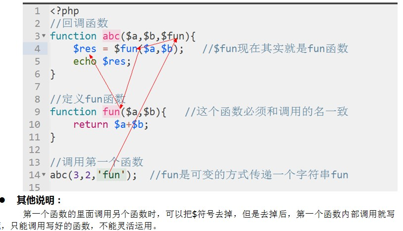
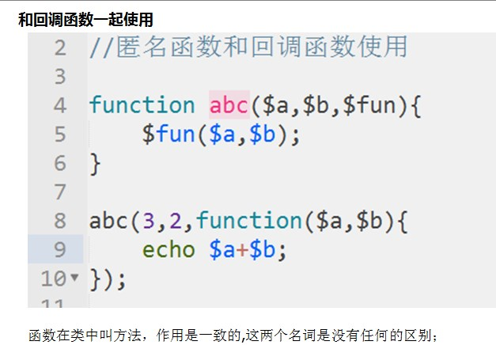

**函数就是把一段有某个功能的代码，进行一个封装，来调用**


**2.函数的创建**

**    1.自定义创建：**


**        function\(形式参数\)  ｛**

**                要实现功能的代码块**

**                return 返回值；**


**           ｝**


**    2.系统自带**


**相关细节**

**    在创建函数时，函数名后面的括号中添加的是形式参数，可有可无**


**    形式参数：接收“函数调用者”传递过来的“实际参数**

**    实际参数：函数调用时，传递给形式参数的实际的值”**

**    如果需要传递参数，那形式参数必须和实际参数数量一致**

**  建议所有函数都有返回值，不在函数内打印**

**    形参和实参一般一致的，形参可以多于实参，可以给形参夹默认值**

**    参数可以是多种类型（数组，整型，浮点，null，资源等），一般是标量加数组**


## **2.可变函数**

```
function changeAble() {
    echo 1；
}； #后面为可变函数的加
$s = 'changeAble'; #这里的值必须和函数名一致
$s();    #$s当成changeAble函数执行 
```

注：可以和回调一起用，实参的传递是函数

## 3.内部函数

    说明：在函数内部在声明一个函数，防止外部调用

```
function insider() {
     #code...
    function sider() {    #内部函数
        #code..
   }
}
```

注：只调用内部函数会报错

## 4.回调函数

## 5.匿名函数

    说明：也叫闭包函数，允许临时创建一个没有名称的函数，最经常用做回调函数的值

  


  


```
$a = function abc()　｛
　　　echo 1;
｝;   #匿名函数没有名称，必须有分号
```

和回调函数一起使用



#  3.函数的引用

函数的封装，必须使用php提供的引入函数引入到某个文件进行函数的调用，引入方式有4种，

- include：可以多次引入同一文件，有错误照样执行，
- incldue\_once：不能多次引入同一文件，有错照样执行
- require：可以多次引入同一文件，有错误不执行
- require\_once;不能多次引入同一文件，有错不执行

