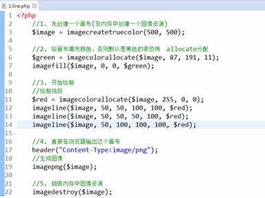
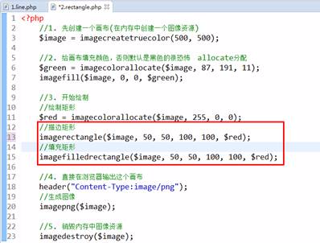
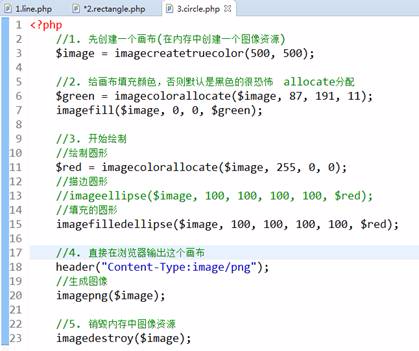
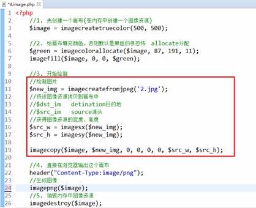
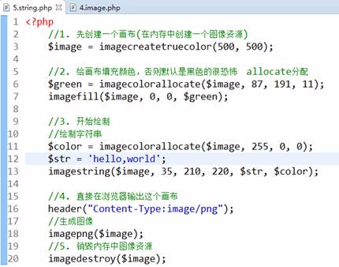
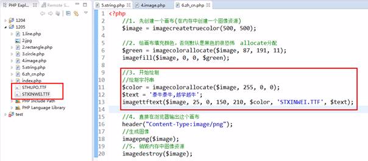
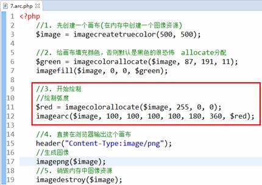
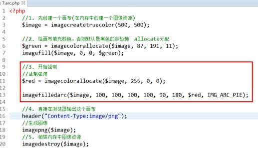

 流程：

1.创建图像资源（画布）

2.分配颜色并填充（不填充就是默认黑色）

3.在图像资源中绘制图像

4.直接输出图像

5.销毁图像

  


（1）

绘制三角形：

imageline\(\)



  


  


（1）绘制矩形：imagerectangle\(\)、imagefilledrectangle\(\)

  


  


（1）绘制圆形和椭圆形：imageellipse\(\)、imagefilledellipse\(\)

  


（1）将图片绘制到画布上：imagecopy\(\)



（1）绘制字符串：imagestring\(\)



（1）绘制中文：imagettftext\(\)



  


（1）绘制弧形：imagearc\(\)

说明：三点钟的位置是起点（0度）



（1）绘制扇形：imagefilledarc

  


  


**验证码类**

```
<?php
/*
 * 验证码类
 */
class Captcha
{
    //成员属性
    private $_width = 100;  //画布默认宽度
    private $_height = 20;  //画布默认的高度
    private $_font = 15;    //验证码字体大小
    private $_number = 4;   //默认显示4个字符
    //成员方法
    //生成一张图像，并输出到浏览器
    public function makeImage()
    {
        //1. 先创建一个画布(在内存中创建一个图像资源)
        $image = imagecreatetruecolor($this->_width,$this->_height);
        
        //2. 给画布填充颜色，否则默认是黑色的很恐怖    allocate分配
        $color = imagecolorallocate($image, mt_rand(200,255), mt_rand(200,255), mt_rand(200,255));
        imagefill($image, 0, 0, $color);
        
        //创建随机的文字
        $code = $this -> makeCode();
        //将随机的字符输出到图像资源中
        //让字符串居中显示（思路：画布的宽高-字符的宽高）/2
        //通过imagefontwidth()获得一个字符的宽度
        $src_w = imagefontwidth($this->_font);
        //imagefontheight(font)获得在font这个字体下一个字符的高度
        $src_h = imagefontheight($this->_font);
        //四个字符的宽度
        $str_len = $src_w * $this -> _number;
        //因为就一行，所以高度就是一个字符的高度
        $x = ($this->_width - $str_len)/2-10;
        $y = ($this-> _height - $src_h)/2;
        
        //字体的颜色
        $color = imagecolorallocate($image, mt_rand(0,100),mt_rand(0,100),mt_rand(0,100));
        
        //imagestring($image, $this->_font, $x, $y, $code, $color);
              
        for($i=0;$i<$this -> _number;$i++){
            imagettftext($image, 20, mt_rand(0,45), $x+$i*20, $y+20, $color, 'STXINWEI.TTF', $code[$i]);
        }
        
        //添加100个干扰像素点
        for($i=0;$i<100;$i++){
            //生成随机的颜色
            $color = imagecolorallocate($image, mt_rand(100,255),mt_rand(100,255),mt_rand(100,255));
            //绘制像素点
            imagesetpixel($image, mt_rand(0,$this->_width), mt_rand(0,$this->_height), $color);
        }
        //添加10条干扰线条
        for($i=0;$i<5;$i++){
            $color = imagecolorallocate($image, mt_rand(150,250),mt_rand(150,250),mt_rand(150,250));
            imageline($image, mt_rand(0,$this->_width), mt_rand(0,$this->_height), mt_rand(0,$this->_width), mt_rand(0,$this->_height), $color);
        }
        
        //4. 直接在浏览器输出这个画布
        header("Content-Type:image/png");
        //生成图像,如果增加第二个参数表示保存到本地
        imagepng($image);
        //5. 销毁内存中图像资源
        imagedestroy($image);
    }
    //产生随机文字的函数
    private function makeCode()
    {
        //随机的文字可能是数字、字母
        //range()会产生一个从a到z的字符的集合（数组）
        $upper_str = range('A','Z');
        $lower_str = range('a','z');
        $num = range(1,9);
        
        //把上面三个数组合并
        $data = array_merge($upper_str,$lower_str,$num);
        //为了让产生的数字更随机,先打乱一下顺序
        shuffle($data);
        
        //从上面数组中随机取出4个
        $randoms = array_rand($data,4);
        
        //通过下标获得对应的字符
        $str = '';
        foreach ($randoms as $v){
            $str .= $data[$v];
        }  
        //将生成的随机的字符，保存起来，便于将来在其他地方使用
        session_start();
        $_SESSION['captcha_code'] = $str;
        return $str;
    }
    //验证用户输入的验证码和我们生成是否一致
    //$code是调用函数时传递进来的，将传递的验证码和生成的session中的比较(不区分大小写)
    public function checkCode($code)
    {
        session_start();
        $result = strtoupper($code) == strtoupper($_SESSION['captcha_code']);
        if($result){
            return true;
        }else{
            return false;
        }
    }
}
```

  


**  
**

**图片压缩类**


```
<?php
/*
 * 封装图像压缩处理类
 */
class Thumb
{
    private $_filename;     //待压缩处理的文件
    private $_thumb_path;   //压缩之后保存的路径
    private $_mime;         //图像的mime类型
    //保存创建图像资源的函数列表
    private $creat_func = array(
        'image/png'     =>  'imagecreatefrompng',
        'image/jpeg'    =>  'imagecreatefromjpeg',
        'image/gif'     =>  'imagecreatefromgif'
    );
    //保存图像类型和生成图像资源的映射关系
    private $output_func = array(
        'image/png'     =>  'imagepng',
        'image/jpeg'    =>  'imagejpeg',
        'image/gif'     =>  'imagegif'
    );
    //new对象时传递的参数会自动传递到构造函数中
    public function __construct($filename)
    {
        if(!file_exists($filename)){
            echo '请输入正确的文件';
            return false;
        }
        $this -> _filename = $filename;
        //初始化该文件的mime类型
        $this -> _mime = getimagesize($filename)['mime'];
    }
    //根据图像资源类型获得对应的创建函数
    private function get_create_func()
    {
        //根据图像资源获得对应的创建函数
        return $this->creat_func[$this->_mime];
    }
    //根据图像资源获得对应的输出、生成函数
    private function get_output_func()
    {
        return $this->output_func[$this->_mime];
    }
    public function setThumbPath($path)
    {
        $this -> _thumb_path = $path;
    }
    
    //制作压缩图像
    public function makeThumb($area_w,$area_h)
    {
        //原理：将原图进行压缩，压缩之后拷贝到目标图像资源里面
        //参数2：原图资源
        $create_func = $this->get_create_func();
        $src_image = $create_func($this -> _filename);
        //参数3：拷贝到目标图像资源中的x轴落脚点
        $dst_x = 0;
        //参数4：拷贝到目标图像资源中的y轴落脚点
        $dst_y = 0;
        //参数5：原图的裁剪时的x轴落脚点
        $src_x = 0;
        //参数6：原图的裁剪时的y轴落脚点
        $src_y = 0;
        
        //参数9：原图的宽度
        $src_w = imagesx($src_image);
        //参数10：原图的高度
        $src_h = imagesy($src_image);
        
        //参数7：目标图像的宽度
        //如果原图的宽/范围的宽    小于  原图的高/范围的高
        //1000*800    100*50
        if($src_w/$area_w < $src_h/$area_h){
            $scale = $src_h/$area_h;            
        }
        if($src_w/$area_w >= $src_h/$area_h){
            $scale = $src_w/$area_w;
        }
        $dst_w = (int)$src_w / $scale;
        $dst_h = (int)$src_h / $scale;
        
        $image = imagecreatetruecolor($dst_w, $dst_h);
        
        //参数8：目标图像的高度
        //针对png图像背景透明化处理
        $color = imagecolorallocate($image, 255, 255, 255);
        //将白色透明化处理
        imagecolortransparent($image,$color);
        imagefill($image, 0, 0, $color);
        
        imagecopyresampled($image, $src_image, $dst_x, $dst_y, $src_x, $src_y, $dst_w, $dst_h, $src_w, $src_h);
        
        //告诉浏览器
        $sub_path = date('Ymd').'/';
        if(!is_dir($this->_thumb_path.$sub_path)){
            mkdir($this->_thumb_path.$sub_path,0777,true);
        }
        //确定文件名称
        $filename = 'thumb_'.basename($this->_filename);
        
        //生成、保存图像资源
        $output_func = $this->get_output_func();
        $output_func($image,$this->_thumb_path.$sub_path.$filename);
        //关闭资源
        imagedestroy($image);
        imagedestroy($src_image);
        
        //返回压缩图像的地址
        return $sub_path.$filename;
        
    }
}
```

**  
**

**  
**

**  
**

