说明：以关键字class开头，后面跟类名（采用首字母大写的驼峰式命名），后面跟一对花括号，里面包含着类的属性和方法  


类：类是描述一类事物的一个总称，是具有相同特征特性的该类事物的一个通用名字（称呼）；


对象：对象是一个明确的具体的物体”，是某个类中的一个“实物”（相对来说，类就是一种抽象的泛称）


属性：原来的变量，写在一个类中，称为属性；

    语法：对象-&gt;属性名；

方法：原来的函数，写在一个类中，称为方法；

    语法：对象-&gt;函数名（参数\)

注意：以上不能单独使用，必须通过类或这个类的对象去使用


## 2.创建对象的几种形式

**    class Obje {**

**            var $p1 = 1; \#定义一个属性**

**}**

  1.$ob1 =new Obje\(\);    \#通过一个类 new一个新对象

  2.$obje2 = new $ob1\(\);    \#通过一个对象，new出一个对象，$ob1称为$obje2的父级，可以继承$ob1的方法

  3.$tree = 'C1' ;$o3 = new $tree\(\);    \#可变类

  4.$o4 = new self\(\);    \#self表示当前类，只能出现在一个类的方法中


## 3.类中成员概述

  分为3大类：

        1.常量

        2.属性：普通属性，静态属性

        3.方法：实例方法，静态方法，构造方法，析构方法

### 3.1-类常量

    定义形式：const 常量名=常量值

    使用形式：使用类名+ 范围解析符（：：）来取用 类名：：常量名

### 3.2-普通属性（实例属性）

    定义形式：var $属性名 = 值 或 pulic $属性名 = 值

    使用 形式：$对象-&gt;属性名

### 3.3静态属性

    说明：静态变量只有一份数据，只属于类  普通属性，创建一个对象就有一份数据

    定义形式：static $属性名 = 值

    使用形式：类名：：$属性名    （普通属性调用不用带$符号）

    普通属性与静态属性的区别：普通：每个对象独有的数据  


                                                    静态：只属于类，或所有对象共有的数据

### 3.4-普通方法

    定义形式：

```
class 类名 {
    function 方法名（参数）{
    }
}
```

    调用形式：$对象名-&gt;方法名（参数）

### 3.4-静态方法 

```
class 类名 {
    static function 方法名{
        //方法体
    }
}
```

    调用形式：

        类名：：方法名（参数）

    $this:表示调用当前方法的对象 $this-&gt;p1 $对象-&gt;方法（） $this 表示$对象里的$p1属性

    self:表示本身所在的这个类

    普通方法中可以调用静态属性  self：：$p1

    静态方法中不能使用普通（实例）属性 == 不能使用 self：：$p1;

**使用地方：实际开发中使用的模式，单例模式  
**

**细节说明：**

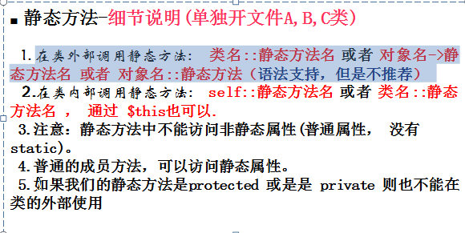

**什么时候用到静态方法：**

    1.当我们需要操作静态属性时，往往会开发一个静态方法

    2.当我们后期开发oop时，需要某些模式时

### 3.5构造方法

    说明：

        1.名字是固定的：\_\_construct;

        2.该方法通常不能自己调用，而是在new一个对象的时候会自己调用

        3.该方法主要目的是为了new一个对象的时候，给对象设置一些“初始值”（初始化工作）

        4.构造方法的参数没有规定，根据实际的需要来定义，目的为了对象属性数据的初始化

####     默认构造函数

            1.一个类中只能有一个构造函数，不能有多个

            2.如果程序员自己写了一个构造函数，就覆盖了默认的构造函数

            3.如果自己写了一个构造函数，我们在创建对象实例式，就按照该构造函数的形参列表传值  


**  $this 说明**  


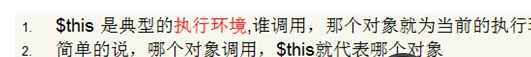

使用：

    new出一个新对象时，会自动调用该类的构造方法

    new后面的类名括号中，传输对应实参

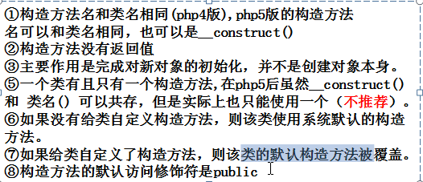

### 3.5-析构方法

**    基础概念：**

        1.在对象销毁前，被调用，在析构函数中，可以去释放资源    

        2.被调用的时机：

                a.php执行完毕后，会被调用

                b.当一个对象，没有任何变量引用时，该对象的析构函数会被调用

    基本语法：

        访问修饰符  function \_\_destruct\(\) {

                //code

           }

    说明：

        1.是个特殊方法，名字为固定的次：\_\_destruct

        2.是一个对象被销毁的时候自动调用的方法--我们无法调用

        3.不能带参数，方法中可以使用$this这个词，代表当前对象

        4.对象销毁的顺序，默认情况，与创建的顺序相反；

        5.修饰符是public

        6.是系统自动调用

总结：

        （1）对象被销毁了，并不意味着对象的资源被销毁了

        （2）如果我们希望在销毁对象时，及时的释放相关连接（文件连接，数据库连接，绘图资源）

        （3）在我们的析构函数中，到底是不是释放资源，取决于业务逻辑-&gt;如果后面还需再使用数据库连接，就不要释放【通常情况下，不需要关闭】


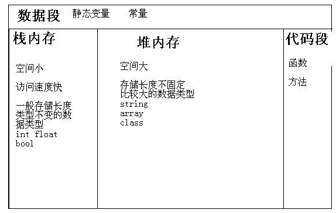

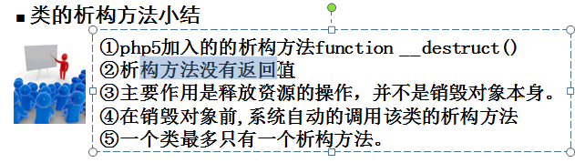

# 魔术方法

    当满足某个条件时，魔术方法会被自动调用

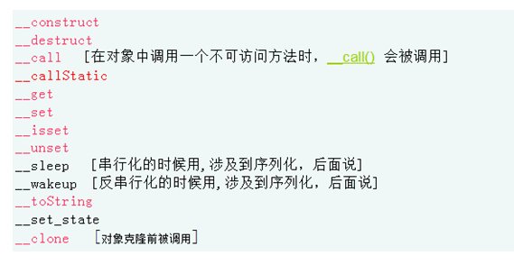

 是设计好的，名字不能修改

2.都是使用\_\_开头，自己定义方法时，不要使用\_\_开头

3.是当某个条件满足时，会被系统自动调用，程序员不会自己调用，


 读值/取值

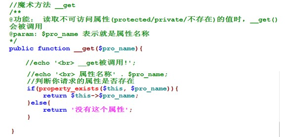

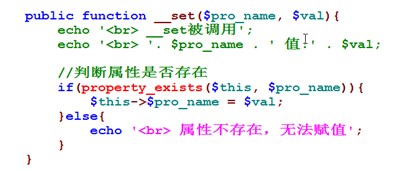

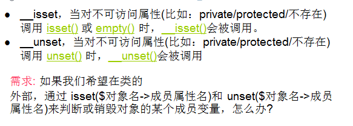

查询值/删除值

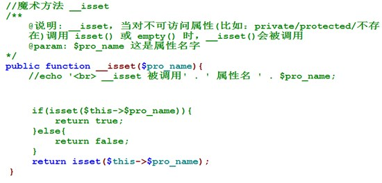

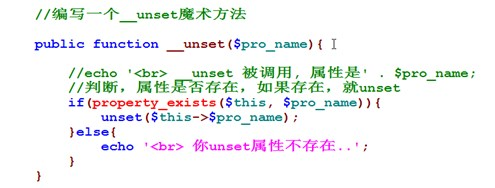

**\_\_toStriing:将对象以字符串的形式输出**

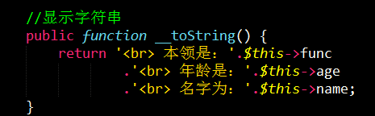

** \_\_clone\(\):复制类的属性和值，且保证数据的独立**

用处：如果希望这个数据只有一份

\_call\(\)


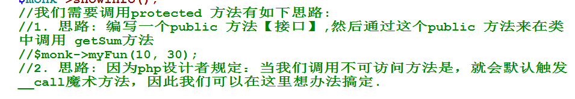

# 类的自动加载

    类文件的命名规范：类名+点+class

  


  


