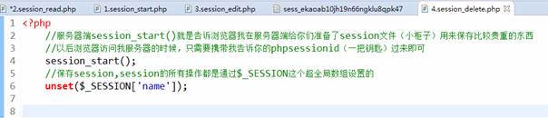
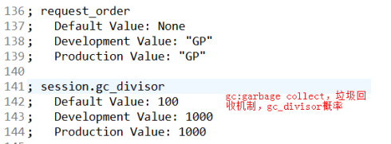

cookie:

cookie

是客户端技术，服务器把每个用户的数据以

cookie

的形式写给用户各自的浏览器。当用户再使用浏览器去访问服务器的

web

资源时就会带着各自的

cookie

数据去。这样服务器通过浏览器身上的

cookie

区分用户

cookie的增加


cookie的修改：

当我们调用

setcookie

函数时，如果

cookie

的名字已经存在，就会覆盖，相当于修改。而且声明周期也会重新计算

删除

cookie：


cookie的细节：

一个cookie只能标识一个字符串信息，如果是整数会被自动转换成字符串，如果需要保存多个数据，多次调用setcookie实现

一个web站点（网站），可以给一个浏览器设置多个cookie，浏览器就会在自己身上保存多个cookie

一个浏览器最多设置300个cookie文件，一个web站点（服务器）最多存储20个cookie文件，而且每个cookie最多存储4K大小的数据，当然由于浏览器的不断升级，cookie的大小也不断提高

如果我们设置

cookie

时，没有指定有效期，默认就是在当前脚本的周期内有效，脚本执行结束

cookie

也就释放掉，如果指定了有效期，会在有效期结束后，释放

cookie

数据

如果想将

cookie

设置的长久有效，可以将有效期设置为

PHP\_INT\_MAX

，这是

php

能够保存的最大的整数


  


SESSION技术：

如果是一些敏感的数据（密码、历史记录等）最后不要保存到

cookie

中，原因有

2

：效率问题、安全问题

说明：使用前一定要开启session start（）

  


考性虑到版本兼容，开启前不要有输出

修改session：


如果session数组中某个元素已经存在就表示重新赋值


删除session：


方法1：删除一个session变量



方法2：删除所有的session数据（不建议删除所有，通常需要删除哪个session就删除哪个就可以了）


方法3：销毁存储session的文件


  


cookie 和session 的区别：

1、cookie数据存放在客户的浏览器上，session数据放在服务器上。

2、cookie不是很安全，别人可以分析存放在本地的COOKIE并进行COOKIE欺骗  
   考虑到安全应当使用session。

3、session会在一定时间内保存在服务器上。当访问增多，会比较占用你服务器的性能  
   考虑到减轻服务器性能方面，应当使用COOKIE。

4、单个cookie保存的数据不能超过4K，很多浏览器都限制一个站点最多保存20个cookie。

5、所以个人建议：  
   将登陆信息等重要信息存放为SESSION

   其他信息如果需要保留，可以放在COOKIE中

  


除了免登陆功能用cookie外，别的一律放session里就行。没必要考虑那么复杂

  


来源： [http://www.cnblogs.com/shiyangxt/archive/2008/10/07/1305506.html](http://www.cnblogs.com/shiyangxt/archive/2008/10/07/1305506.html)

  




  


ini\_set\(\)这个函数在php脚本中单独设置

使用注意事项：

不用使用数字作为session的下标

如果&lt;?php之前出现空白，也会被回应道浏览器

1.1session的存储机制


1.1重写session存储机制的必要性：数据访问量大时

（1）setcookie时，因为服务器以响应头的形式返回，所以在setcookie之前不能有任何输出

（2）当我们关闭浏览器，表示这次会话结束，下次再访问服务器，会给你分配一个新的session\_id

（3）session\_start时，告诉浏览器设置一个cookie，保存session\_id，cookie默认的有效期就是0，一旦我们关闭浏览器，cookie的值也就释放掉

  


开始实现存储到数据库  


&lt;?php

//重写session的存储机制

//告诉PHP不用保存到files里面了，保存到数据库里面

//参数1：php的配置项；参数2：使用自定义的函数来处理session

    ini\_set\("session.save\_handler","user"\);


//通过该函数设置session的存储

    session\_set\_save\_handler\('open','close','read','write','destroy','gc'\);


//参数1：开启session时执行的操作
```

**function**open\(\){

//初始化数据库连接

        $link = @mysql\_connect\('127.0.0.1:3306','root','root'\);

mysql\_select\_db\('php\_5'\);

mysql\_query\("set names utf8"\);

    }

//参数2：脚本执行结束时执行的操作

**function**close\(\){

**echo**'执行完毕';

**return true**;

    }

//参数3：读取session数据，什么时候触发呢？当session\_start\(\)的时候去数据库读取，发序列化然后赋给$\_SESSION

//浏览器随身携带session\_id，也就是说会自动将session\_id传递进来

**function**read\($sess\_id\){

//从数据库读取session文件，反序列化，初始化给$\_SESSION

        $sql ="SELECT session\_content FROM session WHERE session\_id='$sess\_id'";

        $result =mysql\_query\($sql\);

**if**\($row = mysql\_fetch\_assoc\($result\)\){

**return**$row\['session\_content'\];

        }**else**{

**return**'';

        }

    }

//参数4：将session数据写入到数据库

//当脚本执行完毕之际才会将数据存储到数据库

//说明：自动将session数据传递到该函数中

**function**write\($sess\_id,$sess\_content\){

        $sql ="INSERT INTO session VALUES\('$sess\_id','$sess\_content',".time\(\)."\)";


//die\($sql\);

**return**mysql\_query\($sql\);

    }

//参数5：销毁session数据，其实也就是删除session记录

//删除某个浏览器对应的session文件，所以php也会自动将浏览器身上的session\_id传递进来

**function**destroy\($sess\_id\){

        $sql ="DELETE FROM session WHERE session\_id='$sess\_id'";

**return**mysql\_query\($sql\);

    }

//参数6：垃圾回收机制，是一个概率

//session的垃圾回收机制是一个概率：通过gc\_divisor和  gc\_propobility概率

//当触发垃圾回收机制时会自动传递最大的生命周期进来$max\_lifetime

**function**gc\($max\_lifetime\){

        $sql ="DELETE FROM session WHERE last\_time &lt; ".time\(\)."-$max\_lifetime";

**return**mysql\_query\($sql\);

    }
```

  


