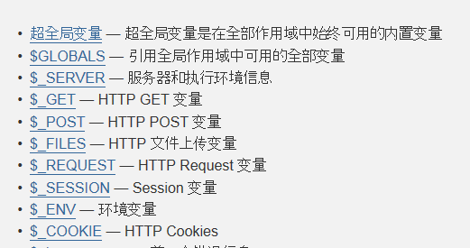
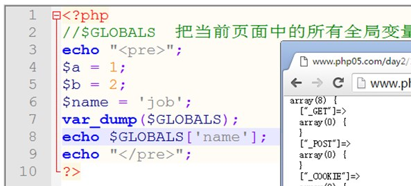
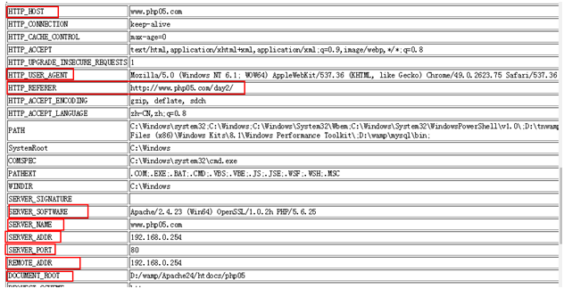
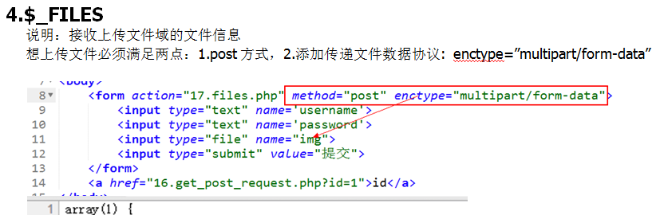
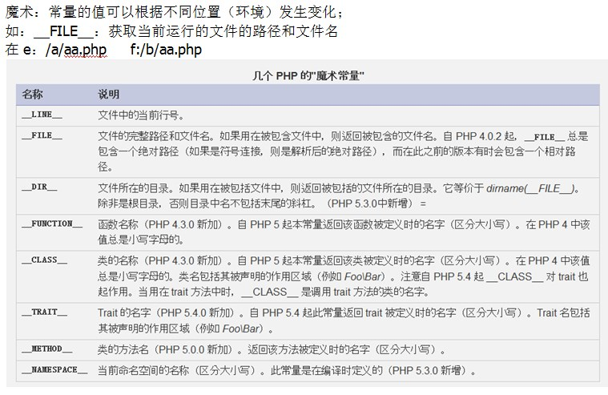

1.$GLOBALS

    说明：引用全局作用域可用的全部变量

  

2.$\_SERVER

  

3.$\_GET 和 $\_POST $\_REQUEST

    $\_GET

    $\_POST

    $\_REQUEST:接收get和post传递过来的数组

4.$\_FILE

    说明：接收上传文件域的文件信息

    想上传文件必须满足2点：用post方式 2.添加传递文件数据协议

&lt;enctype="multipart/form-data"&gt;

  

#  2.预定义常量

  

